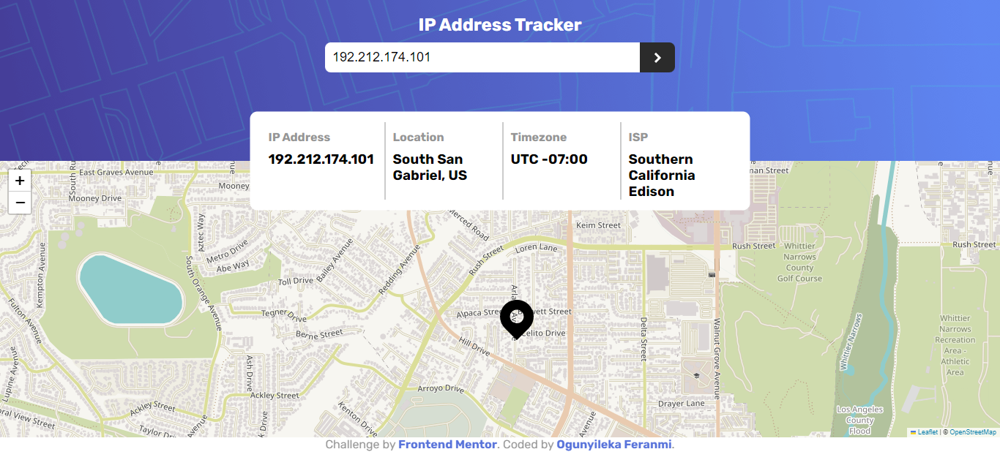

# Frontend Mentor - IP address tracker solution

This is a solution to the [IP address tracker challenge on Frontend Mentor](https://www.frontendmentor.io/challenges/ip-address-tracker-I8-0yYAH0). Frontend Mentor challenges help you improve your coding skills by building realistic projects. 

## Table of contents

- [Overview](#overview)
  - [The challenge](#the-challenge)
  - [Screenshot](#screenshot)
  - [Links](#links)
- [My process](#my-process)
  - [Built with](#built-with)
  - [What I learned](#what-i-learned)
- [Author](#author)

## Overview

### The challenge

Users should be able to:

- View the optimal layout for each page depending on their device's screen size
- See hover states for all interactive elements on the page
- See their own IP address on the map on the initial page load
- Search for any IP addresses or domains and see the key information and location

### Screenshot

### Links

- Solution URL: [https://github.com/Mayor-Isaac/IP-Address-Tracker.git]
- Live Site URL:[https://idyllic-ip-tracker.netlify.app/]

## My process

### Built with

- Semantic HTML5 markup
- CSS custom properties
- Flexbox
- CSS Grid
- Mobile-first workflow
- [Leaflet](https://leafletjs.com/) - JS library
- [Geo.ip](https://geo.ipify.org/) - IP address API
- [Api.ip](https://api.ipify.org/) - IP address API

### What I learned

How to get IP address and how to work with leaflet (JavaScript Library for maps)

## Author

- LinkedIn - [Feranmi Ogunyileka](https://www.linkedin.com/in/feranmi-ogunyileka-359a1723b)
- Frontend Mentor - [@Mayor-Isaac](https://www.frontendmentor.io/profile/Mayor-Isaac)
- Twitter - [@mayor_idyllic](https://www.twitter.com/mayor_idyllic)

